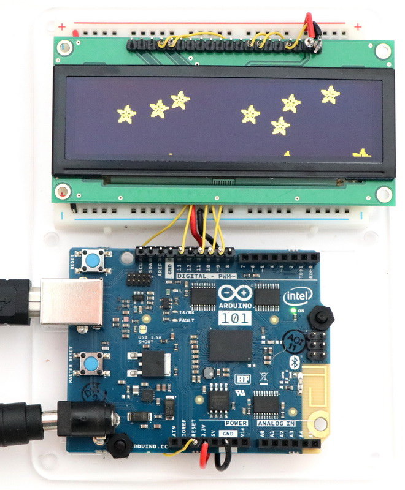

# Arduino/ESP8266 SSD1322 Library
## For Newhaven NHD-3.12-25664UCY2 OLED Display

The [Adafruit GFX](https://github.com/adafruit/Adafruit-GFX-Library) introduces graphics primitives (points, lines, circles, etc.). This library add support for the [Newhaven NHD-3.12-25664UCY2](http://www.newhavendisplay.com/nhd31225664ucy2-p-3537.html) 256x64x16 Yellow OLED Display.  The driver supports 4-wire SPI mode.

!! Do not use a version of the Adadfruit GFX library newer then v1.5.3 !!

This repository was forked from [ESP8266_SSD1322](https://github.com/winneymj/ESP8266_SSD1322) that in turn was based on [Adafruit SSD1306](https://github.com/adafruit/Adafruit_SSD1306).

### Introducing support for Arduino 101

Changes compared to [ESP8266_SSD1322](https://github.com/winneymj/ESP8266_SSD1322):

* Add support for the Arduino 101 (native 3.3 Volt, base on Intel Curie)
* Along the way, I did some minor touch ups:
  * add support for !RESET connected to hardware reset instead of GPIO pin (saves me 1 pin)
  * remove unused variables (`rowTerminated`, `offScreen`, `color`)
  * suppress compiler warning strict-aliasing when accessing fonts
  * remove unused pointer value access e.g. `string++` instead of `string++`
  * add test for `flash_address` unassigned
  * add headers to files indicating support for SSD1322.

### Wiring

| OLED	        | Arduino 101             |
| ------------ | ----------------------- |
| #1 (Vss)	    | GND                     |
| #2 (Vdd)     |	3V3 (up to 271 mA, use external power supply to Arduino 101) |
| #4 (D/!C)    |	D9                      |
| #7 (SCLK)	   | D13 (hardware SPI SCLK) |
| #8 (SDIN)	   | D11 (hardware SPI MOSI) |
| #16 (!RESET)	| !RESET                |
| #17 (!CS)	   | D10                   |
| #5,#6,#10-14,#19,#20	| GND           |
| #3, #9, #15, #18	    | not connected |

Tested and passed on Arduino 101. I like this display, and being able to use the Adafruit GFX primitives is even better!

### Details

For the datasheet and protocol details refer to

* [data sheet](http://www.newhavendisplay.com/specs/NHD-3.12-25664UCY2.pdf)
* [app note](http://www.newhavendisplay.com/app_notes/SSD1322.pdf)

